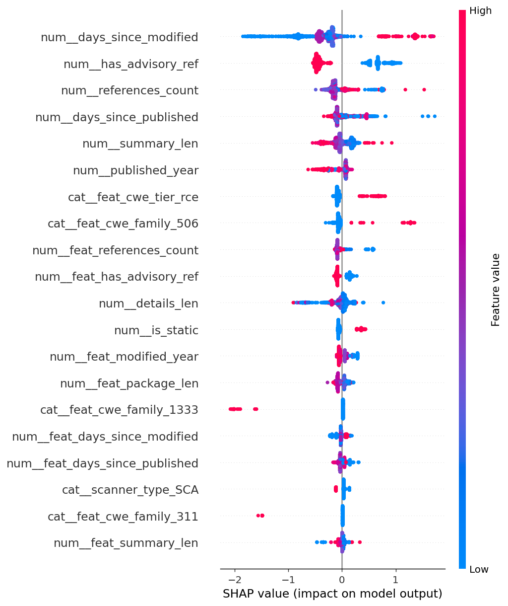

# VulnPriority AI Model Explanation

## Current model

The active VulnPriority model is a **single v4 stacked binary classifier** used for vulnerability prioritization.

| Item | Value |
|---|---|
| Model type | XGBoost stacked ensemble (v4) |
| Training rows | 7,114 |
| Positive rate | 16.4% |
| Split type | group split |
| Features | 51 |
| Threshold strategy | f1 |
| Selected threshold | 0.386 |
| Text features enabled | True |
| Sample weights | True |
| Hyperparameter tuning | Optuna, 60 trials, 4-fold grouped CV |

The model outputs a probability that a vulnerability belongs in the high-risk priority group. The backend converts that probability into dashboard-friendly fields: `ai_probability`, `ai_risk_score`, `ai_risk_label`, `ai_decision`, and `ai_confidence`.

## Why one model is used

The project previously experimented with more than one model. The final architecture uses one v4 model because it gives one consistent prioritization signal for the dashboard, API, documentation, and report. This avoids contradictory explanations where one model is described as scientific confidence while another is described as practical queue ordering.

The final v4 model is still leakage-safe: it is trained and validated with controls designed to prevent shortcut learning.

## Training approach

The v4 model is a stacked ensemble:

```text
XGBoost + Random Forest + Logistic Regression
        |
        | out-of-fold predictions
        v
Calibrated logistic meta-learner
```

The training script uses grouped splitting, grouped cross-validation, Optuna hyperparameter tuning, early stopping, optional OSV text fetching, engineered text/CWE features, and sample weighting based on label confidence.

## Leakage controls

The training pipeline applies the following leakage controls:

- EPSS, CVSS, and scanner severity are used to build labels only, not as model input features.
- Raw label/target columns are removed from the feature matrix.
- Direct identifiers and label-availability proxies are removed.
- The test set is split off first and scored once at the end.
- Grouped cross-validation keeps related vulnerabilities together.
- The preprocessor is refit inside every fold.
- The stacking meta-learner is trained from out-of-fold predictions.
- Sample weights are derived from label-construction signals and applied only to training rows.

## Feature set

The final model uses 51 feature columns. The feature set includes:

- package metadata,
- publication/modification timing,
- reference counts,
- advisory/patch reference indicators,
- scanner type,
- static/dynamic scanner flags,
- CWE family and CWE exploitability tier,
- text length and word count,
- vulnerability keyword indicators,
- package scope and package length.

Examples of active feature columns:

```text
package_name, published_year, days_since_published, days_since_modified, ranges_count, versions_count, summary_len, details_len, references_count, github_reviewed, has_patch_ref, has_advisory_ref, scanner_type, is_static, is_dynamic, feat_cwe_family, feat_has_cwe, feat_cwe_tier
```

## Model performance

Balanced default operating point:

| Metric | Value |
|---|---:|
| Threshold | 0.386 |
| Accuracy | 0.8946 |
| Precision | 0.7098 |
| Recall | 0.5957 |
| F1 | 0.6478 |
| F1-macro | 0.7929 |
| MCC | 0.5895 |
| Balanced accuracy | 0.7742 |
| ROC-AUC | 0.9056 |
| AUC-PR | 0.7387 |

Confusion matrix:

|  | Predicted low | Predicted high |
|---|---:|---:|
| Actual low | 1128 | 56 |
| Actual high | 93 | 137 |

## Threshold choice

The default threshold is `0.386`. It is selected as the balanced operating point for day-to-day triage.

The model metadata also documents a high-recall mode:

| Mode | Threshold | Precision | Recall | F1 | F1-macro | MCC |
|---|---:|---:|---:|---:|---:|---:|
| Balanced default | 0.386 | 0.7098 | 0.5957 | 0.6478 | 0.7929 | 0.5895 |
| High-recall mode | 0.194 | 0.5075 | 0.7391 | 0.6018 | 0.7512 | 0.5206 |

The dashboard uses the balanced default unless the backend configuration is changed.

## SHAP explanation

SHAP is used to explain which features most influenced the model. The beeswarm plot shows both feature importance and direction of impact. Points to the right increase the model output; points to the left decrease it. Red means the feature value is high, blue means it is low.



Top SHAP features:

| Feature | Mean absolute SHAP |
|---|---:|
| `has_advisory_ref` | 0.5711 |
| `days_since_modified` | 0.5085 |
| `references_count` | 0.2480 |
| `days_since_published` | 0.1588 |
| `feat_word_count` | 0.1516 |
| `summary_len` | 0.1385 |
| `details_len` | 0.1260 |
| `feat_cwe_tier_rce` | 0.1105 |
| `feat_kw_remote` | 0.0929 |
| `feat_cwe_family_506` | 0.0928 |
| `feat_text_len` | 0.0900 |
| `feat_references_count` | 0.0809 |

Important interpretation notes:

- `days_since_modified` and modification year features show that recently modified vulnerability records can influence prioritization.
- Advisory/reference features show that vulnerabilities with richer external advisory evidence can receive stronger model attention.
- Text and keyword features help the model identify patterns such as remote exploitation, injection, or code execution language.
- CWE tier features group technical weakness types into broader exploitability categories.

SHAP does not prove causality. It explains how the trained model used the available features on the evaluated dataset.
